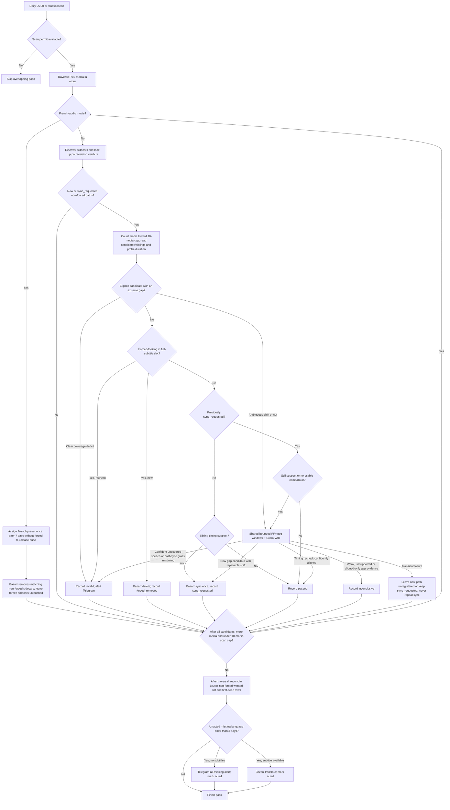

## 2. Problem Statement

Subtitle files reach the library from Bazarr downloads and from transcoding extraction, and some of them are wrong: a
full-dialogue slot filled by a forced track, or a track whose timing drifts from the media. Other media stay without
subtitles for days because no provider has them, and French-audio media keep requesting full subtitles they never need.
The feature is a scheduled, incremental scan that fixes what it can through Bazarr, alerts the operator on what it
cannot, and keeps Bazarr's per-media language requests aligned with the audio actually played.

- `[G-1]` Analyze non-forced sidecars on episodes and movies without French preferred audio once per full file path and scan version, except that a current-version `sync_requested` file is rechecked on later eligible passes; never re-analyze a file already marked `passed`, `forced_removed`, `invalid`, or `inconclusive` at the current scan version.
- `[G-2]` Remove unwanted forced subtitles and re-synchronize suspected out-of-sync subtitles through Bazarr.
- `[G-3]` For media missing subtitles for more than 3 days, alert on Telegram when none exist and translate through Bazarr when one exists.
- `[G-4]` Keep only forced sidecars on French-audio movies: assign the Bazarr French preset, remove existing non-forced sidecars through Bazarr, and release the forced request after 7 days without one.
- `[G-5]` Flag clearly corroborated extreme coverage gaps before sync without audio; use bounded audio only when coverage is ambiguous or a timing recheck remains unresolved, and abstain when that evidence is insufficient.

## 3. Key Design Decisions

| Decision                             | Choice                                                                                                                                                                                                                                                                                                                                                                                                                                                                                                                                 | Rationale                                                                                                                                                                                                                                                                                                                                                                                                                                                                                                                                                                                                                                                                                                                                                                    |
| ------------------------------------ | -------------------------------------------------------------------------------------------------------------------------------------------------------------------------------------------------------------------------------------------------------------------------------------------------------------------------------------------------------------------------------------------------------------------------------------------------------------------------------------------------------------------------------------- | ---------------------------------------------------------------------------------------------------------------------------------------------------------------------------------------------------------------------------------------------------------------------------------------------------------------------------------------------------------------------------------------------------------------------------------------------------------------------------------------------------------------------------------------------------------------------------------------------------------------------------------------------------------------------------------------------------------------------------------------------------------------------------- |
| `[KD-1]` Entry points                | Register `Subtitle Scan` on `0 5 * * *` and the `/subtitlescan` Telegram command as the manual trigger for the same pass.                                                                                                                                                                                                                                                                                                                                                                                                              | Subtitle changes arrive through Bazarr on its own schedule; a daily pass is enough to honor 3-day and 7-day windows while keeping the library traversal off the 12-hour jobs. One command name means one owner, so this feature is the sole registrant of `/subtitlescan`.                                                                                                                                                                                                                                                                                                                                                                                                                                                                                                   |
| `[KD-2.1]` Scan identity             | Key the scan registry solely by full subtitle path; `SUBTITLE_SCAN_VERSION` is a lookup-validity filter.                                                                                                                                                                                                                                                                                                                                                                                                                               | Path identity supersedes content hashing to skip registered files without reading their contents. Same-path replacements intentionally reuse a verdict only while its version remains current; renames and version changes require analysis. Full paths distinguish matching basenames in different directories.                                                                                                                                                                                                                                                                                                                                                                                                                                                             |
| `[KD-3.1]` Registry scope            | Retain one latest analyzed record per `filePath`, with its scan version and verdict (`passed`, `forced_removed`, `sync_requested`, `invalid`, `inconclusive`); skip terminal verdicts at the current version but recheck `sync_requested`.                                                                                                                                                                                                                                                                                             | Inconclusive means insufficient evidence, not valid or invalid; cache it to avoid decoding the same uncertain media every pass. Transient failures leave `sync_requested` retryable. A successful re-analysis at a changed version replaces the path's prior row; identical contents at different paths remain independent.                                                                                                                                                                                                                                                                                                                                                                                                                                                  |
| `[KD-4]` Unwanted forced             | A forced-looking `.<lang>.srt` file (no `.forced.` marker) is ineligible for the coverage verdict and cannot be its reference. An unregistered file is deleted through Bazarr; a `sync_requested` recheck records `invalid` and alerts instead.                                                                                                                                                                                                                                                                                        | A forced track in the full-subtitle slot hides the real gap from Bazarr; deleting through Bazarr rather than the filesystem updates its history so the language returns to the wanted list and is searched again. Files named `.forced.srt` are wanted by construction. Replacement search is left to Bazarr's wanted-search schedule.                                                                                                                                                                                                                                                                                                                                                                                                                                       |
| `[KD-5]` Out-of-sync detection       | Match sorted start timestamps one-to-one within 500 ms between sibling `.srt` files; fewer than half the shorter track's cues matching is a cheap timing **suspicion**, never individual invalidity evidence.                                                                                                                                                                                                                                                                                                                          | Translations split or omit cues, so cue indices are not correspondence. Preserve the existing cheap Anora-safe comparator; sibling timing disagreement alone cannot condemn either file.                                                                                                                                                                                                                                                                                                                                                                                                                                                                                                                                                                                     |
| `[KD-6.1]` Sync target               | After excluding extreme coverage-deficient/forced tracks, request Bazarr sync once per path/version for new timing suspects. A `sync_requested` path is never synced again: unresolved timing requires its own audio assessment, even when a prior comparator is no longer usable.                                                                                                                                                                                                                                                     | Bazarr owns rewrites; HTTP success is not a verified alignment verdict. Each surviving file is assessed independently for timing, so sibling disagreement alone cannot trigger its invalid alert.                                                                                                                                                                                                                                                                                                                                                                                                                                                                                                                                                                            |
| `[KD-7]` Missing-subtitle clock      | Persist the first time each `(bazarr item, language)` appears in Bazarr's wanted list and act once when that row is older than 3 days.                                                                                                                                                                                                                                                                                                                                                                                                 | Bazarr's wanted list is the authoritative "missing" signal for the configured profile but carries no age; a first-seen row gives a deterministic 3-day window and an `actedAt` marker makes the alert or translation happen once.                                                                                                                                                                                                                                                                                                                                                                                                                                                                                                                                            |
| `[KD-8]` French-audio identity       | A media is French-audio when its media-domain `preferredLanguage` is `fr`.                                                                                                                                                                                                                                                                                                                                                                                                                                                             | `preferredLanguage` is the audio Plex plays (`src/features/language_sync/language_sync.spec.md`); it defaults to the original language, so French films and French-dubbed media are both covered by one rule.                                                                                                                                                                                                                                                                                                                                                                                                                                                                                                                                                                |
| `[KD-9]` Profile lifecycle           | Persist `(bazarr item, assignedAt, releasedAt)`; assign the preset once, release the profile after 7 days without a `fr` forced subtitle, and never reassign a released item.                                                                                                                                                                                                                                                                                                                                                          | Without a terminal state the next pass would see French audio again and reassign the preset, producing a 7-day assign/release loop.                                                                                                                                                                                                                                                                                                                                                                                                                                                                                                                                                                                                                                          |
| `[KD-10]` Bazarr boundary            | Add a thin `src/integrations/bazarr` client exposing wanted lists, item lookup by path, subtitle sync/translate/delete, and profile listing/assignment.                                                                                                                                                                                                                                                                                                                                                                                | Bazarr is a vendor; the integration owns HTTP shape and validation while the feature owns policy, matching the arr and Plex clients (`docs/project_structure.spec.md` `[PI-3]`).                                                                                                                                                                                                                                                                                                                                                                                                                                                                                                                                                                                             |
| `[KD-11]` Completeness before repair | Clearly corroborated extreme tail **and interior** gaps are `invalid` before sync when a usable non-forced, non-forced-looking sibling has sustained coverage; an extreme gap that could also be a shifted translation requires bounded audio instead. Forced-looking candidates abstain, and rejected tracks are excluded before timing decisions.                                                                                                                                                                                    | This is a conservative **coverage policy**, not proof of dialogue from timings. Duration and validated cue intervals anchor a gross deficit; reference span/density and candidate coverage outside the gap must be credible, while reciprocal/shared gaps, sparse references, ordinary cut differences without an extreme gap, and malformed evidence do not authorize a metadata invalid. A plausible global shift with an extreme gap needs audio before any action. An extreme supported interior gap can be invalid even when caused by a different cut. A plausible but wrong longer sibling can still cause a false invalid alert; the operator explicitly accepts that residual risk for Hateful Eight-style gaps rather than decoding audio for every new candidate. |
| `[KD-12]` Low-CPU audio fallback     | For ambiguous extreme coverage gaps **before sync** or unresolved timing rechecks, decode a small bounded set of windows from an explicitly selected audio stream via FFmpeg and extract speech intervals with Silero VAD; share a single capped window budget across coverage and timing checks for the same media item/pass (movie or episode).                                                                                                                                                                                      | Short sampled decoding limits cost even with neural VAD. Use a pinned Silero ONNX model and maintained ONNX Runtime Web rather than an unmaintained WebRTC Node binding, full-media ASR, or audio checks on every file. Neither VAD overlap nor a sync tool's offset proves subtitle content.                                                                                                                                                                                                                                                                                                                                                                                                                                                                                |
| `[KD-13]` Conservative verdict       | Independently compare each pending file's cue pattern with speech across informative sampled windows, allowing ordinary subtitle lead/lag. After one unsuccessful sync, timing-based `invalid` requires confident gross misalignment. For an ambiguous gap, a new candidate's confidently repairable shift gets one sync; confident uncovered speech without a plausible repairable shift can invalidate. Sparse, noisy, contradictory, unsupported or merely aligned samples that cannot certify the gap are terminal `inconclusive`. | A sampled timing pass is not proof of full-movie correctness: local defects outside the windows may be missed. An uncertain track must never produce an invalid alert.                                                                                                                                                                                                                                                                                                                                                                                                                                                                                                                                                                                                       |
| `[KD-14]` French-movie precedence    | Apply the French profile policy before file analysis; remove every matching non-forced movie sidecar through Bazarr regardless of cached scan verdict, and skip normal file analysis for that movie.                                                                                                                                                                                                                                                                                                                                   | Changing the wanted profile alone does not remove existing full subtitles. A forced sidecar must remain untouched; a cached `passed` or pending `sync_requested` verdict must not keep an unwanted full sidecar.                                                                                                                                                                                                                                                                                                                                                                                                                                                                                                                                                             |

## 4. Principles & Intents

- `[PI-1]` Incremental by default — file analysis over a library whose paths are all `passed`, `forced_removed`, `invalid`, or `inconclusive` at the current version performs directory listings and registry lookups only, without hashing or reading subtitle contents. Mutations are triggered by an unregistered path, a scan-version bump, or an elapsed window; `sync_requested` paths are deliberately rechecked.
- `[PI-2]` Bazarr owns subtitle files — deletion, sync, translation, and download are Bazarr requests; the feature never writes a subtitle file itself.
- `[PI-3]` Per-item resilience — a media, Bazarr, or filesystem failure is logged and the traversal continues, as in `src/features/language_sync/jobs/language.job.ts:20`.
- `[PI-4]` Act once — every time-window action (alert, translate, release) is recorded so a daily cadence never repeats it.

## 5. Non-Goals

- `[NG-1]` Local subtitle rewrites, transcription, translation-quality/content checks, and full-media audio analysis. Read-only, bounded speech verification is permitted for ambiguous extreme coverage gaps and unresolved timing rechecks; neither metadata nor sampled speech certifies dialogue content.
- `[NG-2]` Choosing subtitle providers, scores, or languages beyond the profiles configured in Bazarr.
- `[NG-3]` Scanning subtitle streams embedded in the media container; only sidecar `.srt` files are analyzed.
- `[NG-4]` Reporting a per-pass summary to Telegram; only all-missing alerts and invalid-subtitle alerts are user-facing.

## 6. Caveats

- `[C-1]` Bazarr, Plex, and this service must see the same file paths; item lookup matches Bazarr's `path` against the Plex part path, like `src/integrations/arr/sonarr.service.ts:34`.
- `[C-2]` The forced heuristic requires the media duration, which comes from an ffprobe of the media file (`src/features/transcoding/services/helpers/subtitle.ts:18`). The probe runs only for episodes or non-French-audio movies with at least one candidate: an unregistered or current-version `sync_requested` non-forced subtitle file.
- `[C-3]` A new media with a single non-forced sidecar has no comparison reference and passes the cheap check; a lone `sync_requested` file still owes audio verification if its old comparator disappears.
- `[C-4]` Same-path rewrites and replacements reuse a current-version `passed`, `forced_removed`, `invalid`, or `inconclusive` verdict. A current-version `sync_requested` path is rechecked on the next eligible pass; it is never synced twice at that version. Renaming or bumping the scan version makes any path eligible as unregistered.
- `[C-5]` Bazarr API paths and payloads (`/api/movies/wanted`, `/api/episodes/wanted`, `/api/subtitles`, `/api/system/languages/profiles`, `/api/movies`, `/api/episodes`) follow Bazarr 1.4; the integration validators pin the fields the feature reads and must be checked against the deployed version.
- `[C-6]` The French preset is resolved by name from `BAZARR_FRENCH_PROFILE`; a missing profile is logged and prevents assignment and cleanup for French movies without an existing profile row. Previously assigned or released French movies can still have non-forced sidecars removed. French movies skip normal file analysis; other media's scan and the missing-subtitle policy continue.
- `[C-7]` Releasing a profile sets the Bazarr item's language profile to none; Bazarr then stops listing it as wanted, so the `released` state lives only in this feature's table.
- `[C-8]` Missing-subtitle rows are removed when the `(item, language)` leaves Bazarr's wanted list, so a subtitle that later disappears restarts the 3-day clock.
- `[C-9]` Translation uses the first present non-forced subtitle of the item as source; Bazarr chooses the translation engine.
- `[C-10]` This amendment describes intended behavior, not the fully implemented pipeline. French-movie profile-first cleanup is implemented; the scan service still uses sibling disagreement to invalidate rechecks, registry version 2 has no `inconclusive` value, and no Silero VAD adapter exists here. A genuine pinned Silero model ran offline under source and compiled macOS Bun in a local experiment, but confidence thresholds, reusable licensed fixtures, and Linux/Nix packaging remain unverified; do not enable audio-based invalid verdicts from that smoke test alone.
- `[C-11]` SRT timings and movie duration cannot prove which untrusted sibling matches the audio. A clearly corroborated extreme coverage mismatch may be `invalid` without audio, accepting residual wrong-reference risk; an ambiguous extreme gap (including one consistent with a globally shifted translation) instead receives selective audio assessment before sync/pass/invalid. Insufficient sampled evidence is terminal `inconclusive`, not `passed` or `invalid`. Some Hateful-like gaps may therefore require audio or remain inconclusive; only the specifically calibrated Hateful Eight-style fixture is expected to invalidate without audio. Ordinary timing disagreement alone never triggers a coverage invalid.

## 7. High-Level Components

The flow below describes the intended complete design; French-movie cleanup is implemented, but the coverage gate, audio rechecks, and `inconclusive` verdicts are not yet implemented (`[C-10]`).



| Component             | Module type                     | Responsibility                                                                                                 | Public API surface                                                                                 |
| --------------------- | ------------------------------- | -------------------------------------------------------------------------------------------------------------- | -------------------------------------------------------------------------------------------------- |
| Scan job              | Effect job + Telegram command   | Traverse Plex media and run the three policies per item under one permit                                       | `runSubtitleScan`, `/subtitlescan`                                                                 |
| Scan registry         | Drizzle schema + repository     | Persist analyzed paths, missing first-seen rows, and profile lifecycle                                         | `subtitleScans`, `missingSubtitles`, `frenchProfiles`, repository functions                        |
| Analysis service      | Effect service                  | Classify new/rechecked files, share bounded speech evidence, and request Bazarr actions                        | `scanMediaSubtitles`                                                                               |
| Speech boundary       | FFmpeg integration + Silero VAD | Select reference audio stream; decode bounded windows and return speech intervals, without rewriting subtitles | Typed read-only audio interface                                                                    |
| Missing policy        | Effect service                  | Reconcile wanted list with first-seen rows and act after 3 days                                                | `applyMissingPolicy`                                                                               |
| French profile policy | Effect service                  | Assign/release the French preset and remove existing non-forced movie sidecars via Bazarr                      | `applyFrenchProfilePolicy`                                                                         |
| Bazarr client         | Integration                     | Typed Bazarr HTTP surface                                                                                      | `IBazarrClient`, `Bazarr` service key, `BAZARR_API_URL`, `BAZARR_API_KEY`, `BAZARR_FRENCH_PROFILE` |

## 8. Detailed Design

### Scan job

`runSubtitleScan` acquires a single scan permit (an item is skipped, not queued, when a pass is running), reads Plex sections and media, resolves `getCompleteMediaDetails` per item, and applies `applyFrenchProfilePolicy` first for French-audio movies, skipping `scanMediaSubtitles` for them; other media run `scanMediaSubtitles`. `applyMissingPolicy` runs once per pass after traversal because it is driven by Bazarr's wanted list rather than by Plex items. Non-interruption failures per item are logged with the media title and the loop continues; the job's own failure is logged at the scheduler boundary.

For a safe initial rollout, traversal stops after 10 media with candidate non-forced subtitle paths at the current scan version across all Plex sections; candidates are unregistered paths and current-version `sync_requested` paths. Each movie/episode counts once regardless of its number of candidates, including analysis failures after candidates are identified. French-audio movies never consume the file-analysis cap, even when cleanup fails; media with no candidates and failures before eligibility is known also do not consume it. This fixed cap applies to scheduled and manual passes; French-profile processing runs for every traversed French-audio movie, before its file-analysis decision. Each pass starts from the beginning in Plex order; `sync_requested` paths consume a recheck slot, while `passed`, `forced_removed`, `invalid`, and `inconclusive` paths let later passes advance without a cursor. Missing-subtitle reconciliation, translations, and alerts remain library-wide and run after the capped traversal.

- `[SO-4]` French-audio movies and media with only current-version `passed`, `forced_removed`, `invalid`, or `inconclusive` paths do not consume the 10-media file-analysis budget, allowing later passes to reach new paths; rechecks on other media consume the budget — demonstrated by `[VC-5]` and `[VC-12]`.
- `[VC-5]` Job tests verify French-audio movies, cached and forced-only media are skipped by the counter, new candidates are capped across sections even when analysis fails, metadata failures do not consume slots, and a following manual pass advances past passed paths registered by a scheduled pass. Service tests verify rechecks invoke the same scan counter — demonstrates `[SO-4]`. Terminal inconclusive eligibility is additionally covered by `[VC-12]`.

`/subtitlescan` submits the same pass to `BackgroundTasks`, replies `Starting subtitle scan...` or `A subtitle scan is already running.` according to permit admission, and returns `{ step: 'idle' }`; it produces no report (`[NG-4]`).

### Scan registry

The current implementation owns `SUBTITLE_SCAN_VERSION = 2`, a positive integer constant shared by `/subtitlescan` and the scheduled pass. Increment it once when the combined completeness/audio behavior ships, so old false verdicts are reconsidered without deleting rows. The existing 500 ms / 50% sibling timing heuristic and forced thresholds remain the cheap suspicion rules. The next pass treats all paths without a verdict at the new version as unregistered, including old `passed`, `forced_removed`, `sync_requested`, or `invalid` paths. Old verdicts are neither skip signals nor trusted references. A bump does not launch a pass itself; the schedule or command does.

Version bumps increase monotonically and are not reused; compatible relaxations may retain the current version. A row is valid only when its stored version matches the current version; a successful re-analysis replaces the row for that path with the new version and verdict, so no historical versions are retained and no registry purge is needed. The version is not a Telegram argument or environment setting. It does not reset `missingSubtitles` clocks/action markers or `frenchProfiles` lifecycle state, and it does not invalidate transcode results.

```ts
export const subtitleVerdictEnum = pgEnum('subtitle_verdict', ['passed', 'forced_removed', 'sync_requested', 'invalid', 'inconclusive'])
export const bazarrKindEnum = pgEnum('bazarr_kind', ['movie', 'episode'])

export const subtitleScans = pgTable('subtitle_scans', {
  filePath: text('file_path').primaryKey(),
  scanVersion: integer('scan_version').notNull(),
  verdict: subtitleVerdictEnum().notNull(),
  scannedAt: timestamp('scanned_at').notNull(),
})

export const missingSubtitles = pgTable(
  'missing_subtitles',
  {
    bazarrKind: bazarrKindEnum('bazarr_kind').notNull(),
    bazarrId: integer('bazarr_id').notNull(), // radarrId or sonarrEpisodeId
    language: text({ enum: ISO1 }).notNull(),
    firstSeenAt: timestamp('first_seen_at').notNull(),
    actedAt: timestamp('acted_at'),
  },
  (t) => [primaryKey({ columns: [t.bazarrKind, t.bazarrId, t.language] })]
)

export const frenchProfiles = pgTable(
  'french_profiles',
  {
    bazarrKind: bazarrKindEnum('bazarr_kind').notNull(),
    bazarrId: integer('bazarr_id').notNull(),
    assignedAt: timestamp('assigned_at').notNull(),
    releasedAt: timestamp('released_at'),
  },
  (t) => [primaryKey({ columns: [t.bazarrKind, t.bazarrId] })]
)
```

Repository functions follow `src/domains/media/repositories/media.repository.ts`: each wraps Drizzle in `Database.use` and maps rejections to `DatabaseQueryError`. Lookups require both `filePath` and the current scan version. `subtitleScans` writes use `onConflictDoUpdate({ target: subtitleScans.filePath, set: row })`, replacing the entire row after a successful analysis so each full path has one latest record. The tables live in `src/database/schema.ts` with migrations under `migrations/`. `migrations/20260921190858_scan_path_primary_keys` updates both scan tables, retaining the latest record per full path by `scanned_at DESC, ctid DESC` before making inline `filePath` its sole primary key. No version bump is needed for the identity change.

Terminal records survive restarts and have no time-based expiry. Scheduled and manual passes use the same registry: `passed`, `forced_removed`, `invalid`, and `inconclusive` paths are not analyzed again at that version. Passed siblings may be read as references; rejected/forced/inconclusive siblings are not references. A `sync_requested` path is rechecked on the next eligible pass and becomes `passed`, `invalid`, or `inconclusive` only when the evidence supports it; transient or unclassified failures leave it retryable without repeating sync. A rename or scan-version bump is a new candidate; a content rewrite at a terminal path is not. Failed or interrupted analysis never records `passed`, and a failed registry write leaves the path eligible for a later pass.

`migrations/20260923115940_invalid_subtitle_verdict` added `invalid` without changing existing records. The new `inconclusive` enum value needs an additive migration applied before code can write it; preserve existing rows. A rollback after writing the new value must keep compatible code/data. The combined behavior bumps the scan version once; sync/alerts may occur again for old terminal paths at the new version (deduplication is per full path/version, not lifetime).

This registry is independent of the passed-file registry in `src/features/transcoding/transcoding.spec.md`. A successfully checked media file skips further transcode analysis for that identity, not subtitle analysis or the missing/French policies. Transcoding never marks extracted sidecars as passed: new sidecar paths enter this scan as unregistered candidates. Conversely, a passing subtitle does not certify the media's transcode criteria.

### Analysis service

For media other than French-audio movies, `scanMediaSubtitles(details)` lists sibling files `<base>.<lang>.srt` and `<base>.<lang>.forced.srt` in the media directory, then:

```text
version ← SUBTITLE_SCAN_VERSION
for each non-forced sidecar: known ← registry.get(path, version)
candidates ← sidecars with (known = undefined or known.verdict = sync_requested) and no `.forced.` marker
if candidates is empty → return  # no content reads, probe, Bazarr lookup, or audio
read candidates and usable sibling timings as needed; duration ← ffprobe(media).duration
forcedLooking ← forced heuristic on candidate and reference contents, for coverage eligibility only
coverage ← classify extreme tail and interior gaps from a consistent snapshot, excluding forcedLooking candidates and references
for each clear coverage deficit: record(invalid); alertInvalid(candidate)  # no sync/delete/audio
for each ambiguous extreme gap: defer to bounded audio assessment before any sync/pass/invalid
for each other forced-looking candidate:
  if known.verdict = sync_requested: record(invalid); alertInvalid(candidate)
  else: bazarr.deleteSubtitle(candidate); record(forced_removed)
survivors ← candidates excluding clear coverage deficits, ambiguous gaps awaiting audio, and forced-looking tracks
exclude all rejected, forced, inconclusive and pending ambiguous-gap tracks from sibling references, including during this pass
for each survivor, using the same surviving-reference snapshot:
  if known is new and sibling timing is suspect: bazarr.syncSubtitle(candidate); record(sync_requested)
  else if known is sync_requested and (timing is still suspect or no usable comparator remains):
    defer to shared read-only audio assessment
  else: record(passed)  # existing cheap path
for each deferred candidate, against shared selected-stream speech windows (include gap-focused samples for coverage cases):
  new ambiguous-gap candidate with confidently repairable shift → bazarr.syncSubtitle(candidate); record(sync_requested)
  timing recheck confidently aligned → record(passed)
  confident uncovered speech not explained by a repairable shift, or post-sync gross mistiming → record(invalid); alertInvalid(candidate)
  weak, merely aligned (gap not certified), contradictory, or known unsupported evidence → record(inconclusive)
  transient/unclassified failure → leave a new candidate unregistered or keep sync_requested; never repeat sync
```

Completeness uses sorted, valid start/end intervals within media duration and sustained sibling coverage across a large absolute **and** duration-relative gap; cue count or the final timestamp alone cannot condemn a file. Require credible reference span and density, substantial candidate coverage outside the gap, and a shift-safe guard; exclude forced-looking candidates and references from the coverage gate before taking any forced deletion/recheck action. Compare structural coverage, not cross-language cue-start agreement, which is not a reliable same-cut anchor. Isolated credits, shared gaps, split/merged translations, uniform shifts, reciprocal omissions, sparse references, and malformed tracks cannot establish a confident coverage verdict; a plausible dense but wrong reference over a genuinely speech-sparse movie remains the accepted false-alert limit ([C-11]). Evaluate all candidates before acting, so file iteration order and a rejected sibling cannot determine another file's verdict. A calibrated, clearly corroborated Hateful Eight-style tail deficit or comparably clear interior omission is `invalid` without audio or a futile Bazarr sync. An ambiguous extreme gap, particularly one consistent with a shifted translated track, is neither cheaply passed nor synced as a timing repair; it first receives bounded, gap-focused speech evidence. A confidently repairable shift in a new gap candidate receives its one Bazarr sync, not an immediate invalid alert; a `sync_requested` recheck is never synced again. Confident independent evidence of uncovered speech without a plausible repairable shift can support invalidity, but sparse, contradictory, or merely aligned samples remain `inconclusive` for coverage: they cannot certify the unsampled gap. A reciprocal/shared gap, sparse or absent usable reference, or non-extreme cut difference produces no coverage verdict and follows the ordinary forced/timing check; only an extreme plausible shift with a usable reference enters audio. This is a policy about a gross coverage mismatch, not proof that the longer sibling follows this movie's dialogue ([C-11]). The existing forced heuristic (fewer than 3 cues/minute or under 15% screen-time ratio) applies only afterward. The existing divergence rule (under 50% one-to-one cue starts within 500 ms) remains a cheap suspicion gate. Both timestamp parsers handle LF and CRLF; matching sorts and consumes starts one-to-one. An unresolvable Bazarr item logs a warning and leaves affected actions retryable rather than asserting success.

The audio boundary selects an explicit reference stream using ffprobe metadata and the media's `preferredLanguage`, not the first audio stream or each subtitle's language; missing/ambiguous selection is `inconclusive`. FFmpeg seeks/decodes only a small capped number of short, early/middle/late or dispute-focused windows as 16 kHz mono PCM, converted to the float32 frames expected by the pinned Silero ONNX model, keeping each window's media timestamp. Silero VAD extracts speech intervals with a maintained ONNX Runtime Web WASM backend; pin and package model/runtime bytes and licenses offline without runtime downloads. Keep recurrent state/context continuous within each decoded window, reset at seek/window and media boundaries, and share the resulting speech intervals once per media item/pass (movie or episode) across deferred candidates, including gap-focused windows when coverage is ambiguous. Coverage and timing requests share the same total bounded window budget. Binary PCM never passes through a text-collecting command helper; use bounded memory/time, scoped cleanup, and cancellation that propagates interruption. The initial window budget and separate coverage/timing scoring margins must be calibrated on local fixtures before enabling audio-based invalid verdicts; no persistent cache, transcription, or new threshold environment settings. Compare each file's current timing to plausible large offsets across multiple informative windows, tolerating normal cue lead/lag. Sparse, dense, noisy, or contradictory sampled evidence cannot confidently pass or invalidate. Sampled alignment is not a guarantee about unsampled scenes, translations, or spoken words.

Persist `invalid` before sending the existing best-effort plain-text message to `TELEGRAM_CHAT_ID`: `Invalid subtitle for <media title> (<language>)`. Only the affected file alerts, at most once per terminal verdict/path/version; do not delete it or request a second sync. New sync requests never send Telegram notifications. Log reason, timing/coverage or audio-window evidence and selected stream, not dialogue. Telegram failure does not change the persisted verdict or stop other candidates; failed alerts are not retried. Deterministically unsupported media/stream states become terminal `inconclusive`; crashes, I/O failures, and unclassified faults remain retryable and may continue consuming a scan-budget slot on each pass. This retains the existing operational-starvation limitation rather than adding a retry scheduler.

### Missing policy

```text
wanted ← bazarr.getWantedMovies() ++ bazarr.getWantedEpisodes()
rows ← repository.listMissing()
for each (item, lang) in wanted with lang not forced: upsert first_seen_at = now on absence
delete rows whose (item, lang) is not in wanted
for each row with first_seen_at < now - 3d and acted_at is null:
  item ← wanted[row]
  if item.subtitles (non-forced) is empty:
    telegram.sendMessage(TELEGRAM_CHAT_ID, "No subtitles for <title> after 3 days (missing: en, fr)")   # once per item, not per language
  else:
    if fewer than 3 translation requests have been made this pass:
      bazarr.translateSubtitle(item, source = item.subtitles[0], target = row.language)
      set acted_at = now on success
  else set acted_at = now after a successful alert
```

The all-missing alert groups every unacted row of one item into one message and marks all of them acted. At most three translation requests (including failed requests) are sent per pass across movies and episodes; excess rows stay unacted until a later pass. Alerts do not consume translation slots. A Bazarr or Telegram failure leaves `actedAt` null so the action is retried on the next pass.

### French profile policy

```text
if details.mediaType ≠ movie or details.preferredLanguage ≠ 'fr' → return
item ← bazarr.getMovieByPath(details.file)
if item is missing → log; return  # retry cleanup on next pass; do not run normal analysis
row ← repository.getFrenchProfile(item)
if row = undefined:
  if frenchPresetId is missing → log; return  # do not delete before assigning the wanted profile
  bazarr.setProfile(item, frenchPresetId); insert assigned_at = now
else if row.released_at = null and no `<base>.fr.forced.srt` exists and row.assigned_at < now - 7d:
  bazarr.setProfile(item, none); set released_at = now
for each existing sidecar `<base>.<lang>.srt` with a matching non-forced Bazarr subtitle path:
  bazarr.deleteSubtitle(item, subtitle)  # regardless of scan verdict; never delete `.forced.srt`
```

The preset id is resolved once per pass from `bazarr.getProfiles()` by the name in `BAZARR_FRENCH_PROFILE`. Profile assignment (or an existing assigned/released row) precedes deletion. Only exact matching Bazarr subtitle paths are removed; missing matches and failed deletes are logged and remain eligible on later passes without a file-analysis budget slot. A French-audio movie never enters forced/completeness/sync/audio analysis, even if its old scan row is terminal or `sync_requested`. Because the French preset requests only `fr:forced`, the missing policy's non-forced filter (`[KD-7]`) never alerts or translates for these items after assignment.

### Bazarr client

```ts
export interface IBazarrClient {
  readonly getWantedMovies: Effect.Effect<BazarrItem[], HttpClientError>
  readonly getWantedEpisodes: Effect.Effect<BazarrItem[], HttpClientError>
  readonly getMovieByPath: (filePath: string) => Effect.Effect<BazarrItem | undefined, HttpClientError>
  readonly getEpisodeByPath: (filePath: string) => Effect.Effect<BazarrItem | undefined, HttpClientError>
  readonly getProfiles: Effect.Effect<{ profileId: number; name: string }[], HttpClientError>
  readonly setProfile: (item: BazarrItemRef, profileId: number | null) => Effect.Effect<void, HttpClientError>
  readonly deleteSubtitle: (item: BazarrItemRef, subtitle: BazarrSubtitleRef) => Effect.Effect<void, HttpClientError>
  readonly syncSubtitle: (item: BazarrItemRef, subtitle: BazarrSubtitleRef) => Effect.Effect<void, HttpClientError>
  readonly translateSubtitle: (item: BazarrItemRef, source: BazarrSubtitleRef, target: ISOCode1) => Effect.Effect<void, HttpClientError>
}

interface BazarrItemRef {
  kind: 'movie' | 'episode'
  id: number
} // radarrId | sonarrEpisodeId
interface BazarrSubtitleRef {
  language: ISOCode1
  forced: boolean
  hi: boolean
  path: string
}
interface BazarrItem extends BazarrItemRef {
  title: string
  path: string
  subtitles: BazarrSubtitleRef[]
  missingSubtitles: { language: ISOCode1; forced: boolean }[]
}
```

The client is built on `httpClient` with header `X-API-KEY` and base `${BAZARR_API_URL}/api`, registered as a `Bazarr` service key in `src/core/runtime.service.ts` and constructed in the composition root beside the arr clients. Sync, translate, and delete map to `PATCH`/`DELETE /subtitles` with `action` `sync` or `translate`; profile assignment maps to `POST /movies` or `POST /episodes` with `profileid`. Responses are validated with co-located Effect Schemas that read only the fields above. `BAZARR_API_KEY` supports the `_FILE` secret convention (`src/config/env.ts:3`).

### Timing and notification acceptance

- `[SO-1]` Differently segmented translations no longer trigger sync solely because cue indices differ; cue offsets up to 500 ms are tolerated, while larger timing differences remain eligible for Bazarr sync. CRLF sidecars are parsed like LF files instead of appearing to contain a single cue.
- `[VC-1]` Anora's opening English/French timestamps pass in either argument order; a one-second shifted copy fails. Split/omitted cues, ordering, one-to-one matching, inclusive 500 ms tolerance (400/500 ms pass, 501 ms fails in both argument orders), and the strict majority boundary are covered in `tests/shared/utils/subtitle.spec.ts`; service tests verify a sync recheck within 500 ms passes without another sync or alert — demonstrates `[SO-1]`.
- `[VC-2]` LF and CRLF representations produce identical cue starts and forced verdicts — demonstrates `[SO-1]`.
- `[SO-3]` A current-version `sync_requested` subtitle is rechecked without a version bump or repeat sync: a clear coverage deficit or preserved forced-looking rule records terminal `invalid`; ambiguous coverage and unresolved timing use individual audio evidence for `passed` (timing only), `invalid` or `inconclusive`. A new ambiguous-gap path stays unregistered after an operational failure, while a failed recheck remains `sync_requested`.
- `[VC-4]` Service tests verify the configured recipient, exact invalid-alert media title and subtitle language, absence of a file path, no Telegram notification for newly requested syncs, skipping invalid paths without content reads, probes, Bazarr lookups, scan-budget consumption, or repeated alerts, exclusion of invalid paths from sibling references, no delete/re-sync of an invalid recheck, passing of a confidently aligned recheck, and continued scanning with persisted `invalid` verdicts after Telegram failure — demonstrates `[SO-3]`.
- `[SO-5]` `passed`, `forced_removed`, `invalid`, and `inconclusive` subtitle paths skip hashing and unnecessary content reads across passes and restarts, including same-path replacements; current-version `sync_requested` paths are the deliberate recheck exception — demonstrated by `[VC-6]`, `[VC-7]`, and `[VC-12]`.
- `[VC-6]` Discovery and service tests verify no contents are read when every path is terminal at the current version, renamed paths and identical contents at different paths are independently eligible, version changes recheck files, `sync_requested` paths use forced and sibling timing as gates without asserting individual invalidity from disagreement, and usable passed siblings remain references — demonstrates `[SO-5]`.
- `[VC-7]` `tests/features/subtitle_scan/repositories/subtitle_scan.repository.spec.ts` verifies that a version-change upsert replaces the full row for a path; the combined migration regression is covered by `tests/features/transcoding/repositories/transcode_scan.repository.spec.ts` — demonstrates `[SO-5]`.

- `[SO-6]` Clearly corroborated extreme gaps, including the calibrated Hateful Eight-style missing tail, receive `invalid` without audio or timing repair; ambiguous extreme gaps go to bounded audio before any invalid/pass verdict, and weak evidence becomes `inconclusive` — demonstrated by `[VC-8]`, `[VC-9]`, and `[VC-11]`.
- `[VC-8]` The calibrated Hateful Eight English timing fixture ending around 44 minutes of a 168-minute movie versus its sustained French sibling is the only `invalid` path with one alert and no sync/delete/audio for it; the French path is not synced or invalidated solely because of English — demonstrates `[SO-6]`.
- `[VC-9]` Timing-only fixtures cover clear extreme tail/interior gaps (including an extreme different-cut interior), and distinguish **ambiguous extreme gaps needing audio** from no-gap/forced cases. Global shifted translated tracks with an extreme gap enter audio rather than metadata invalid; shared/reciprocal gaps, sparse references, isolated late credits, ordinary western cut differences and malformed intervals produce no coverage verdict, and forced-looking files retain their Bazarr lifecycle. A separate plausible wrong-longer-reference fixture documents accepted residual risk. Gap-audio tests use multiple informative samples and abstain on sparse, aliased or conflicting speech; neither timing nor VAD proves dialogue content — demonstrates `[SO-6]`.
- `[SO-7]` Grossly mistimed rechecks are assessed per file with bounded, shared speech evidence; good siblings are not condemned by a bad track, and weak evidence abstains — demonstrated by `[VC-10]`, `[VC-11]`, and `[VC-12]`.
- `[VC-10]` Aligned and grossly shifted siblings, two divergent wrong tracks after sync, a sampled partial wrong cut and a lone pending `sync_requested` track produce only evidence-supported per-file verdicts; a new lone track keeps the cheap path. Quiet/noisy/dense or contradictory windows do not generate confident verdicts, and unsampled defects are explicitly not claimed detected — demonstrates `[SO-7]`.
- `[VC-11]` Integration and service tests select/log the intended audio stream, cap FFmpeg decoded window count/duration and memory/runtime **once per media item/pass across both gap and timing cases**, share the speech timeline across pending files, include gap-focused windows only for ambiguous coverage, skip audio for cached/forced/metadata-resolved files, clean resources on failures, and propagate interruption. A generated/licensed offline speech fixture exercises real Silero inference (including repeated-media state reset) under source Bun and a compiled executable — demonstrates `[SO-7]`.
- `[VC-12]` Known unsupported/insufficient cases, including an ambiguous gap with merely aligned sampled evidence, persist terminal `inconclusive` with no invalid alert; later passes skip their reads/audio/cap slot. Transient failures leave new ambiguous paths unregistered or existing `sync_requested` paths retryable without repeated sync, consuming a future cap slot when retried; tests cover later candidates advancing under the ten-media cap — demonstrates `[SO-7]`, `[SO-4]`, and `[SO-5]`.
- `[SO-8]` The combined change preserves versioned scan state, migration compatibility, common entry points, and existing missing-subtitle and non-French Bazarr/Telegram policies — demonstrated by `[VC-13]` and `[VC-14]`.
- `[VC-13]` An additive enum migration retains existing rows and precedes writes of `inconclusive`; a single monotonic version bump rechecks old terminal paths, with sync/alert deduplication per path/version, no registry purge, and the same cron/manual job, ten-media budget, and missing/non-French forced behavior — demonstrates `[SO-8]`.
- `[VC-14]` Full tests, formatting/lint/type checks, target Nix package build, compiled offline speech smoke test, local calibration, and independent review establish runtime feasibility and classification safety before any production scan; unsupported evidence remains a blocker rather than a forced verdict — demonstrates `[SO-8]`.
- `[SO-9]` French-audio movies request only forced French subtitles: any existing non-forced sidecar is removed through Bazarr before normal scan analysis, regardless of its scan verdict; forced sidecars remain — demonstrated by `[VC-15]`.
- `[VC-15]` Given a French-audio movie with a forced French sidecar and non-forced sidecars in `passed` and `sync_requested` states, a pass assigns its preset before deleting the non-forced files by exact Bazarr path, retains the forced file, performs no normal analysis/sync/audio/invalid alert for that movie, and uses no file-analysis slot; failed or unresolved deletions retry on a later pass. Other media still scan normally and the 7-day release remains terminal — demonstrates `[SO-9]`.

Anora's complete downloaded sidecars provide real-media validation: 2,435 English and 2,471 French cues produce 98.03% positional divergence, but 1,348 starts match one-to-one within 300 ms (55.36% of the shorter track), so the revised rule does not request sync. Full-track ffsubsync against the movie's English audio estimates offsets of +10 ms (English) and 0 ms (French), both with framerate scale 1.000. Even after that audio alignment, positional divergence remains 97.95%, explaining why repeated Bazarr rewrites could not satisfy the former rule.

## 9. Open Questions

N/A — `[OQ-1]` (manual trigger: this feature owns `/subtitlescan`, folded into `[KD-1]`), `[OQ-2]` (missing languages come from the Bazarr profile, `[KD-7]`), and `[OQ-3]` (no immediate replacement search, `[KD-4]`) were resolved on 2026-09-08.

## Changelog

| Date       | Amendment                                                                                           | Sections affected | Reason                                                                                            |
| ---------- | --------------------------------------------------------------------------------------------------- | ----------------- | ------------------------------------------------------------------------------------------------- |
| 2026-09-11 | Clarify durable passing records and independence from the transcode passed-file registry.           | 8                 | Skip successful file versions across restarts without one feature suppressing the other's checks. |
| 2026-09-11 | Version subtitle scan verdicts with `SUBTITLE_SCAN_VERSION`.                                        | 2–4, 8            | Re-analyze unchanged subtitles after behavior changes without resetting unrelated policy state.   |
| 2026-09-17 | Temporarily cap Plex traversal at 10 media per pass; keep missing-subtitle processing library-wide. | 8                 | Limit initial scan impact.                                                                        |
| 2026-09-24 | Specify French-movie cleanup, extreme-coverage and bounded-audio verdicts, registry lifecycle.      | 2–4, 8            | Keep the intended policy and retry/alert behavior explicit while calibration remains open.        |
